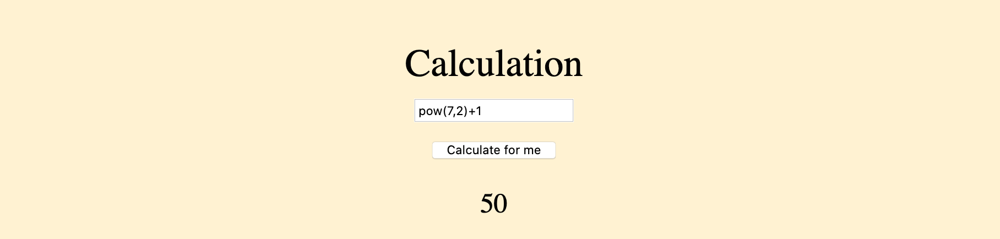

# Down Under CTF 2020

Some writeups about challenges that i have done.

## Forensics

### On the spectrum

> My friend has been sending me lots of WAV files, I think he is trying to communicate with me, what is the message he sent?

We are provided with a WAV audio file. In this cases it is useful to use audio tools like Audacity or Sonic Visualizer in order to look if there is some messages embeded.

In this case just inspecting the spectrogram we can find the flag.


[message_1.wav](./resources/forensic/on_the_spectrum/message_1.wav)

### I Love Scomo

> I really do love Scott Morrison! <3 <3 <3
> However, some people don't like me because of my secret crush :(. So I have to hide my secrets using steganography. This is my hidden space, where I can dream about being with Scomo and I really appreciate that no one tries to reveal my secret message for him.

In this case we have a jpg file, after trying some common vectors i have used stegcracker to test if the file contains some encrypted information encapsulated with steghide.

```
$ stegcracker ilovescomo.jpg /usr/local/share/wordlists/rockyou.txt

StegCracker 2.0.9 - (https://github.com/Paradoxis/StegCracker)
Copyright (c) 2020 - Luke Paris (Paradoxis)

Counting lines in wordlist..
Attacking file 'ilovescomo.jpg' with wordlist '/usr/local/share/wordlists/rockyou.txt'..
Successfully cracked file with password: iloveyou
Tried 69 passwords
Your file has been written to: ilovescomo.jpg.out
iloveyou
```

As you can see it had information inside encrypted with the passphrase iloveyou. The extracted information was inserted inside ilovescomo.jpg.out file.

It has the Australian himn, or that is what i think. 
We must see carefully that some lines has a space at the end and others not. Thats why i will try to translate those who has a space into a 1 and others to 0 with a custom script.

```
f = open("ilovescomo.jpg.out", "r")
s = ""
for line in f.readlines():
    end = line.replace('\n', '')[-1:]
    if end == " ":
        s += "1"
    else:
        s += "0"
print(s)
```

Obtaining the following binary stream.

```
010001000101010101000011010101000100011001111011011010010101111101010010001100110110110001001100011010010101111101101100001100000011000000110000001100000100111100110000011011110110111100110000011101100011001101011111001101010110001100110000011011010011000001111101000000000000000000000000000000000000000000000000000000000000000000000000000000000000000000000000000000000000000000000000000000000000000000000000000000000000000000000000000000000000000000000000000000
```

After decoding it we obtain the flag.

[ilovescomo.jpg](./resources/forensic/i_love_scomo/ilovescomo.jpg)

## Web

### Leggos

> I <3 Pasta! I won't tell you what my special secret sauce is though!

In this case we have access to a simple website. Just inspecting the page source we can find the uri ```/disableMouseRightClick.js``` which is a js file where the flag is printed directly.

[https://chal.duc.tf:30101](https://chal.duc.tf:30101)

## Crypto

### rot-i

> ROT13 is boring!

The title of the challenge sugegst us that this is a rot encryption with different rotation in each character. If we look carefully at the provided file there is a suspicious string with the value ```IAJBO{ndldie_al_aqk_jjrnsxee}``` which must be the flag.
With the following script i managed to decrypt it using a increased rot starting at 5.

```
def unrot(char, rot):
    alphabet = ['a', 'b', 'c', 'd', 'e', 'f', 'g', 'h', 'i', 'j', 'k', 'l', 'm', 'n', 'o', 'p', 'q', 'r', 's', 't', 'u', 'v', 'w', 'x', 'y', 'z']
    if char.lower() not in alphabet:
        return char
    charNew = alphabet[((ord(char.lower())-97)-rot)%len(alphabet)]
    return charNew.upper() if char.isupper() else charNew

input = "IAJBO{ndldie_al_aqk_jjrnsxee}"
output = ""

j = 0

for i in range(5, 100):
   output += unrot(input[j], i)
   j += 1
   if j > len(input)-1:
       break

print(output)
```

[challenge.txt](./resources/crypto/rot-i/challenge.txt)

## Misc

### In a pickle

> We managed to intercept communication between und3rm4t3r and his hacker friends. However it is obfuscated using something. We just can't figure out what it is. Maybe you can help us find the flag?

Just looking at the name of the challenge it is obvious that we must unserialize a python object, just because pickle is the lib used for that.

I created the following script which unpickles it and show it pretty as it is a python dict object.

```
import pickle

f = open('data', 'rb')
obj = pickle.load(f)
print(f"Type: {type(obj)}")
output = ""
for k,v in obj.items():
    if isinstance(v, int):
        output += chr(v)
    else:
        output += v
print(output)
```

[data](./resources/misc/in_a_pickle/data)

### Addition

> Joe is aiming to become the next supreme coder by trying to make his code smaller and smaller. His most recent project is a simple calculator which he reckons is super secure because of the "filters" he has in place. However, he thinks that he knows more than everyone around him. Put Joe in his place and grab the flag.

When we open the website provided with the challenge we see a simple input form which theoretically allows us to make simple aritmetic operations. I suspect that it is executed inside an eval and thats what will allow us to run random code.

Lets try to use a pow function an see if it gets evaluated.



As i thought it got executed so lets try a different payload, something like an ls to list all files in the current directory.

```
__import__("subprocess").getoutput("ls -lah")
```

With that payload you can see that it listed all files.

Now just checking the ```main.py``` file we will grab the flag.

```
__import__("subprocess").getoutput("cat main.py")
```

[https://chal.duc.tf:30302/](https://chal.duc.tf:30302/)